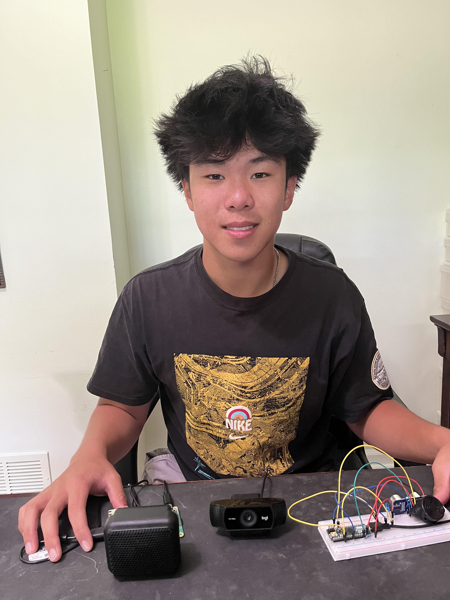

# Third Eye for the Blind
My project the Third Eye for the Blind helps those with visual impairments get a sense of their surroundings by detecting nearby obstacles. The first part of this project uses ultrasonic sensors that send out waves to able to determine how far objects are, alerting the user with a buzzer sound. The second part of this project uses a camera that is trained using machine learning to recognize what different objects are and is able to announce the names of nearby objects using a speaker.  

You should comment out all portions of your portfolio that you have not completed yet, as well as any instructions:
```HTML 
<!--- This is an HTML comment in Markdown -->
<!--- Anything between these symbols will not render on the published site -->
```

| **Engineer** | **School** | **Area of Interest** | **Grade** |
|:--:|:--:|:--:|:--:|
| Alex H | Stevenson High School | Computer Science | Incoming Junior



  
# Final Milestone

<iframe width="560" height="315" src="https://www.youtube.com/embed/WRJlEheVXH8?si=Fs16sknjpH56jeiV" title="YouTube video player" frameborder="0" allow="accelerometer; autoplay; clipboard-write; encrypted-media; gyroscope; picture-in-picture; web-share" referrerpolicy="strict-origin-when-cross-origin" allowfullscreen></iframe>

For my final milestone with BlueStamp, I was able to successfully use my Raspberry Pi to detect real objects you put in front of the camera and speak out loud what it sees. How this project works is incredibly similar to how my second milestone works. I sourced the same object detection model into Visual Studio Code, but this time I wrote my code so that it would access my Raspberry Pi's camera. However, although this sounded relatively simple it was the most challenging part of the entire project. For starters, I spent at least 3 whole days trying to find and use a different object detection model because I initially thought that the YOLO object detection model would not work with Raspberry Pi. However, this led me to many tutorials that broke down and displayed tons of errors around halfway through the installation process because they were all outdated and could not properly be installed on my Raspberry Pi's terminal. Even when I did figure out that YOLO's object detection model could work with Raspberry Pi, I still ran into some challenges because the program initially used opencv2 to process images, but Pi cameras used picamera2. At first, I was frustrated because I couldn't figure out how to process things in real-time and could only figure out how to make the camera take a picture and then process that singular image. However, I figured out that if I put my program in a loop it would be taking pictures over and over again and processing these photos, it would be essentially the same thing as a video (although this video would probably be at a much lower frame rate). I initially finished this project on Tuesday night, 2 days before demo night, and was extremely happy. Unfortunately, while I was showing this to my family and friends my camera overheated and my program stopped working. This was extremely stressful for me as I had not recorded any video of my project working and I didn't know if I would even be able to show anything on demo night. Thankfully, the instructors at BlueStamp were super helpful during this time and not only sent me a different Pi camera but also encouraged me to find my webcam. I ended up using a webcam I found at my home and it worked the day before demo night, though I had to change my program back to using opencv2 because my camera was not a pi camera. There were many points during this final milestone where I was convinced that the path I chose was too challenging or could not be completed in time. However, this program taught me to persevere through challenges and not get intimidated by large obstacles and rather tackle them step by step. Although this was my final milestone with BlueStamp, I do plan on continuing to work on this project and updating this portfolio with my next milestones! At BlueStamp I learned: 
- how to wire a breadboard
- how to set up and code an Arduino
- how to install and use modules online through your terminal
- how to set up and use a Raspberry Pi
- how to debug problems on your own using the internet
- how to do your research and use tools on the internet with your project

I learned a lot from this program and am so happy with the foundation and skills that have been built for me to continue to work on a project on my own, which is something that seemed way too intimidating for me just three weeks ago. 

# Second Milestone

<iframe width="560" height="315" src="https://www.youtube.com/embed/TTsWucJQo_4?si=uUo4_xIt459JmvNt" title="YouTube video player" frameborder="0" allow="accelerometer; autoplay; clipboard-write; encrypted-media; gyroscope; picture-in-picture; web-share" referrerpolicy="strict-origin-when-cross-origin" allowfullscreen></iframe>


For my second milestone, I set up my Raspberry Pi and also coded a working text-to-speech program, and figured out how to source and use an object detection model on Google Colab. Object detection models work through machine learning, where the computer is shown different objects over and over again and is trained to recognize different objects in the real world. I was able to find one online called YOLO (You Only Look Once) and source it into my code. The code used also provides an array of strings so I can store everything the program detects into a string variable that can be spoken out loud. During this time I ran into some difficulties. For instance, Google Colab struggles a bit when accessing your webcam so I was only able to code the object detection in a way so that it would process a singular image I uploaded to it. However, I hope that now that I know how to use object detection on singular images I can use the same logic when it is accessing my Pi camera. I was also able to wire a louder buzzer into my breadboard because the one I used in milestone 1 was too quiet. Before my second milestone, I didn't feel comfortable working in the terminal to install things or access other modules. Now I can say I feel a lot more confident on how to install and use modules. What I also enjoy about BlueStamp is that the instructors encourage you to do your research while building your project rather than handing everything to you and allowing you to follow a step-by-step guide. I feel much more confident doing my own research and developing my skills even when this program is over. For my next milestone, I plan on finally using my speaker and webcam so I can use object detection in the real world and announce everything it sees!


# First Milestone


<iframe width="560" height="315" src="https://www.youtube.com/embed/oOBN37RSwc8?si=N6dqoBFMhnxWx_IW" title="YouTube video player" frameborder="0" allow="accelerometer; autoplay; clipboard-write; encrypted-media; gyroscope; picture-in-picture; web-share" referrerpolicy="strict-origin-when-cross-origin" allowfullscreen></iframe>


For my first milestone, I was able to create a prototype of my project by wiring the Arduino with the buzzer, LED light, and ultrasonic sensor. How this project works is that the trigger pin in the ultrasonic sensor is programmed to repeatedly send out waves that hit objects and reflect into the sensor. The echo pin of the sensor is supposed to record how long it takes for the waves to be sent out and reflected back. Using this time, I was able to figure out the distance of the object. This was done because it takes 29 microseconds for a wave to travel 1 cm, so by dividing the total duration by 29, and then by 2 to account for the wave having to travel to the object and back, I can figure out exactly how far the object is in cm. My buzzer and LED will light up when the object is less than 50 cm away. If the object is closer, the distance will be smaller the LED and buzzer will turn on and off more frequently. Initially, the circuit diagram I was following was also using a switch and a motor, but because I didn't have access to either of those things I had to work my way around that by not including them in my wiring. Another problem I had was that the circuit diagram initially had the LED light and buzzer attached to the 5 pin on the Arduino. However, that caused my LED light to barely light up because the buzzer would take up most of the power. I fixed this by simply attaching my LED to the 6 pin instead and creating a new variable for the new pin to represent the LED in my code so that the LED and buzzer were not fighting for the same power. Another problem I ran into was that the circuit diagram I was using was for the Arduino Pro mini, but I was using the Arduino Micro. I had to figure out how to wire my project in a way that would work for my Arduino micro. Because this is my first time working with electronics in this way, I am happy with my progress and how much I have learned in such a short time. For my next milestone, I hope to add a camera to my project so I can get more detailed information about the objects my project is detecting rather than just distance. 

# Schematics 
.png)

# Code

```c++
const int pingTrigPin = 12; //Trigger connected to PIN 7   
const int pingEchoPin = 10; //Echo connected yo PIN 8   
int buz=5; //Buzzer to PIN 4   
int led = 6;
void setup() {   
  Serial.begin(9600);   
  pinMode(buz, OUTPUT);   
  pinMode(led, OUTPUT);
}   
void loop() 
{   
  long duration, cm;   
  pinMode(pingTrigPin, OUTPUT);   
  digitalWrite(pingTrigPin, LOW);   
  delayMicroseconds(2);   
  digitalWrite(pingTrigPin, HIGH);   
  delayMicroseconds(5);   
  digitalWrite(pingTrigPin, LOW);   
  pinMode(pingEchoPin, INPUT);   
  duration = pulseIn(pingEchoPin, HIGH);   
  cm = microsecondsToCentimeters(duration);   
  if(cm<=50 && cm>0)
  {   
    int d= map(cm, 1, 100, 20, 2000);   
    digitalWrite(buz, HIGH);
    digitalWrite(led, HIGH);   
    delay(100);   
    digitalWrite(buz, LOW);  
    digitalWrite(led, LOW); 
    delay(d);  
  }   
  Serial.print(cm);    
  Serial.print("cm");   
  Serial.println();   
  delay(100);   
}   
long microsecondsToCentimeters(long microseconds){   
  return microseconds / 29 / 2;   
} 
```


```python
{
 #$ export DISPLAY=:0.0
from ultralytics import YOLO
import cv2
import math 
# start webcam (shouldn't set up like this if using picam I used my own webcam) 
cap = cv2.VideoCapture(0)
cap.set(3, 640)
cap.set(4, 480)
import os


# model
model = YOLO("yolo-Weights/yolov8n.pt")

# object classes
classNames = ["person", "bicycle", "car", "motorbike", "aeroplane", "bus", "train", "truck", "boat",
              "traffic light", "fire hydrant", "stop sign", "parking meter", "bench", "bird", "cat",
              "dog", "horse", "sheep", "cow", "elephant", "bear", "zebra", "giraffe", "backpack", "umbrella",
              "handbag", "tie", "suitcase", "frisbee", "skis", "snowboard", "sports ball", "kite", "baseball-bat",
              "baseball glove", "skateboard", "surfboard", "tennis racket", "bottle", "wine glass", "cup",
              "fork", "knife", "spoon", "bowl", "banana", "apple", "sandwich", "orange", "broccoli",
              "carrot", "hot dog", "pizza", "donut", "cake", "chair", "sofa", "pottedplant", "bed",
              "diningtable", "toilet", "tvmonitor", "laptop", "mouse", "remote", "keyboard", "cell-phone",
              "microwave", "oven", "toaster", "sink", "refrigerator", "book", "clock", "vase", "scissors",
              "teddy bear", "hair drier", "toothbrush"
              ]


while True:
    success, img = cap.read()
    results = model(img, stream=True)

    # coordinates
    for r in results:
        boxes = r.boxes

        for box in boxes:
            # bounding box
            #x1, y1, x2, y2 = box.xyxy[0]
            #x1, y1, x2, y2 = int(x1), int(y1), int(x2), int(y2) # convert to int values

            # put box in cam
            #cv2.rectangle(img, (x1, y1), (x2, y2), (255, 0, 255), 3)

            # confidence
            confidence = math.ceil((box.conf[0]*100))/100
            print("Confidence --->",confidence)

            # class name
            cls = int(box.cls[0])
            print("Class name -->", classNames[cls])

            # object details
            #org = [x1, y1]
            #font = cv2.FONT_HERSHEY_SIMPLEX
            #fontScale = 1
            #color = (255, 0, 0)
            #thickness = 2

            #cv2.putText(img, classNames[cls], org, font, fontScale, color, thickness)
            detected = classNames[cls]
            message = detected + "detected"
            os.system("espeak -a 400 " + message)


    cv2.imshow('Webcam', img)
    if cv2.waitKey(1) == ord('q'):
        break

cap.release()
cv2.destroyAllWindows()

}
```


# Bill of Materials

| **Part** | **Note** | **Price** | **Link** |
|:--:|:--:|:--:|:--:|
| Adruino Micro | Microcontroller board| $22 | <a href="https://www.amazon.com/Arduino-Micro-Headers-A000053-Controller/dp/B00AFY2S56/ref=sxts_b2b_sx_reorder_acb_business?content-id=amzn1.sym.44ecadb3-1930-4ae5-8e7f-c0670e7d86ce%3Aamzn1.sym.44ecadb3-1930-4ae5-8e7f-c0670e7d86ce&cv_ct_cx=arduino%2Bmicro&keywords=arduino%2Bmicro&pd_rd_i=B00AFY2S56&pd_rd_r=3c265d26-c144-45b4-b645-a19f57187069&pd_rd_w=ZWCox&pd_rd_wg=dgTyS&pf_rd_p=44ecadb3-1930-4ae5-8e7f-c0670e7d86ce&pf_rd_r=SRN3W01Y55A8M3VF2PXJ&qid=1686186926&sbo=RZvfv%2F%2FHxDF%2BO5021pAnSA%3D%3D&sr=1-1-62d64017-76a9-4f2a-8002-d7ec97456eea&th=1"> Link </a> |
| Micro USB Cable | USB Cable | $5 | <a href="https://www.amazon.com/Charging-Transfer-Android-Trustable-MYFON/dp/B098DW7485/ref=sr_1_6?crid=3USJU0DMSZB2S&keywords=micro%2Busb&qid=1686187078&s=electronics&sprefix=micro%2Busb%2Celectronics%2C106&sr=1-6&th=1"> Link </a> |
| Electronics Component Kit | Contains wires, buzzers, and LEDs| $14 | <a href="https://www.amazon.com/Smraza-Electronics-Potentiometer-tie-Points-Breadboard/dp/B0B62RL725/ref=sxts_b2b_sx_reorder_acb_business?content-id=amzn1.sym.f63a3b0b-3a29-4a8e-8430-073528fe007f%3Aamzn1.sym.f63a3b0b-3a29-4a8e-8430-073528fe007f&crid=2IC3T44H3U3WG&cv_ct_cx=breadboard+kit&dib=eyJ2IjoiMSJ9.TUd5tu2T8rmms7ZuJ0UzmbtpLL1zsu93bQM0PzwnP4E.sT0V0vL_QtbYv8ymVTCcRkhFNgBtRvRiT7G4FT1oGTE&dib_tag=se&keywords=breadboard+kit&pd_rd_i=B0B62RL725&pd_rd_r=67e1f4ff-e3b9-44e4-b441-b4ae282f036b&pd_rd_w=UjFaP&pd_rd_wg=0xRoC&pf_rd_p=f63a3b0b-3a29-4a8e-8430-073528fe007f&pf_rd_r=BFGP77H27ZN31W4PZAW6&qid=1715911733&sbo=RZvfv%2F%2FHxDF%2BO5021pAnSA%3D%3D&sprefix=breadboard+kit%2Caps%2C109&sr=1-2-9f062ed5-8905-4cb9-ad7c-6ce62808241a"> Link </a> |
| HC-SR04 Ultrasonic Sensor Module | Uses sound waves to measure distance of an object | $10 | <a href="https://www.amazon.com/WWZMDiB-HC-SR04-Ultrasonic-Distance-Measuring/dp/B0CQCCGXCP/ref=sr_1_1_sspa?crid=3J2JR973WKPHO&dib=eyJ2IjoiMSJ9.E2SIkElJhtFWCJCHL5Q6Y73Ys_HCMPRVFCIrG_zKv4Og7BdZNtr69Mkju140lhlfzFGQuY542jpsp8FMrtV9d2hCBI7D8lYTH9bcgDXZhs4941uj-d1D69ZYdKmAI1Jig3VmYXOl3axVQ8Jq5L3nGRymNMtNbxkaFqGNyzkq4p37hhxU6jheuoaMo3Onz2FE9ILThkjUbdxRNW3rrZgZ7bYj9mf-yav85hBAmNduYyo.EneY3GmHDfDjDwhdUdDQ4Ktk6fECH62Adb42cEkehRc&dib_tag=se&keywords=ultrasonic%2Bsensor&qid=1715961326&sprefix=ultrasonic%2Bsensor%2Caps%2C72&sr=8-1-spons&sp_csd=d2lkZ2V0TmFtZT1zcF9hdGY&th=1"> Link </a> |
| AstroAI Multimeter Tester | Measures AC/DC Voltage, DC Current, Resistance, and Diode | $11 | <a href="https://www.amazon.com/AstroAI-Digital-Multimeter-Voltage-Tester/dp/B01ISAMUA6/ref=sxin_17_pa_sp_search_thematic_sspa?content-id=amzn1.sym.e8da13fc-7baf-46c3-926a-e7e8f63a520b%3Aamzn1.sym.e8da13fc-7baf-46c3-926a-e7e8f63a520b&cv_ct_cx=digital+multimeter&dib=eyJ2IjoiMSJ9.5LQumrfBR8l0mKnJCJlRg73dxpou0gqYD_ffU3srgs0Utegwth8GcQCSVXVzeZeLSJx5J3itz5TLdmJHsrVITQ.-00jRPoT-bBy26YC4LzQ-S4cYdztgmSMGb83_WEm6HY&dib_tag=se&keywords=digital+multimeter&pd_rd_i=B01ISAMUA6&pd_rd_r=e1ff2570-7e4a-4906-bc55-6f819d48d1bc&pd_rd_w=h7HgL&pd_rd_wg=0ZcFH&pf_rd_p=e8da13fc-7baf-46c3-926a-e7e8f63a520b&pf_rd_r=R6YKX3NXTDQ1PQP4H8RM&qid=1715911879&sbo=RZvfv%2F%2FHxDF%2BO5021pAnSA%3D%3D&sr=1-1-7efdef4d-9875-47e1-927f-8c2c1c47ed49-spons&sp_csd=d2lkZ2V0TmFtZT1zcF9zZWFyY2hfdGhlbWF0aWM&psc=1"> Link </a> |
| Velcro Roll | Strap used to attach project to body | $7 | <a href="https://www.amazon.com/VELCRO-Brand-ONE-WRAP-Double-Sided-Multi-Purpose/dp/B000078CUB/ref=sr_1_21?crid=G8FXTWN2M9TA&keywords=velcro+brand+tape&qid=1685477947&sprefix=velcro+brand+tap%2Caps%2C161&sr=8-21"> Link </a> |
| Portable Power Bank | Powers microchip | $18 | <a href="https://www.amazon.com/SIXTHGU-Portable-Charger-Charging-Flashlight/dp/B0C7PHKKNK/ref=sr_1_2_sspa?crid=2ZZM4AAZMMWHQ&dib=eyJ2IjoiMSJ9.W2Zx5_I3mKOn6UpwAzOw6PD0PNh1iaMRBiedequdv9weeWL0HPyPcxJBR9h6-LiFW-sHKnHSApN0sUxx0Q9xIRs80R57IlvvCsmEzXcktogo-4nP-NxrEZOy5dJTcXY8N-PBwfGt4fl_9LP8npenzDUV9TPA8KN6DMu175g6JegC_gZhAJrbqX94EfpQhLwP9vIJH45w2N-AFrfZZOy9jqk55gzVyk4Qst8uZvqn768.KBrc5_SqZ4e8zCpoFc-1C7rk02t3o2ykgDPB65W5JJU&dib_tag=se&keywords=always%2Bon%2Bpower%2Bbank&qid=1715957917&sprefix=always%2Bon%2Bpower%2Bbank%2Caps%2C107&sr=8-2-spons&sp_csd=d2lkZ2V0TmFtZT1zcF9hdGY&th=1"> Link </a> |


